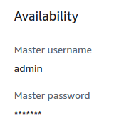

# TicTacToe
## Application
Application allows users to create an account and play tic-tac-toe (3x3) with another logged in random user. 
Homepage displays global users' ranking.

### Gameplay


## Deployment - project 1
### Overall architecture


### Required files for setup on EC2
```text
├── Makefile
├── docker-compose.yaml
├── domain.env
├── aws-credentials.env
├── db.env
└── secret
    └── tictactoe-key-pair.pem
```
[Makefile](Makefile) and [docker-compose.yaml](docker-compose.yaml) are provided by this repository. \
Env files `db.env` and `aws-credentials.env` must be created manually. \
Certificate `secret/tictactoe-key-pair.pem` must be downloaded from AWS. \
Env file `domain.env` will be created during `make send-docker-compose-and-env-file-to-lab` command run.

#### Creating / downloading required files
1. Create `db.env` file containing envs specifying database connection:
   ```dotenv
   SPRING_DATASOURCE_USERNAME=???
   SPRING_DATASOURCE_PASSWORD=???
   SPRING_DATASOURCE_URL=jdbc:mysql://???:3306/tictactoe
   ```
   The values can be found in RDS details:
   
   
   
   
   
   Those credentials are static (they do not change).

2. Provide `secret/tictactoe-key-pair.pem` certificate necessary in order to connect to EC2 instance via ssh.
   It can be downloaded from AWS.

   

3. Create `aws-credentials.env` file containing envs specifying aws credentials:
   ```dotenv
   AMAZON_COGNITO_ACCESS_KEY=???
   AMAZON_COGNITO_SECRET_KEY=???
   AMAZON_COGNITO_SESSION_TOKEN=???
   ```
   
   They can be found on lab CLI in file `~/.aws/credentials`:
   
   
   
   **Those credentials change from time to time therefore before running check if they are still valid.**

### Connecting to EC2
Go to your EC2 instance and copy domain name:


Then run `make connect-to-aws domain_name=???` where `???` represents copied domain name.

For example:
```text
make connect-to-aws domain_name=ec2-54-80-196-162.compute-1.amazonaws.com
```
Returned:
```text
curl ec2-54-80-196-162.compute-1.amazonaws.com:8080/healthcheck
Service healthy
ssh -i ./secret/tictactoe-key-pair.pem ec2-user@ec2-54-80-196-162.compute-1.amazonaws.com
   ,     #_
   ~\_  ####_        Amazon Linux 2023
  ~~  \_#####\
  ~~     \###|
  ~~       \#/ ___   https://aws.amazon.com/linux/amazon-linux-2023
   ~~       V~' '->
    ~~~         /
      ~~._.   _/
         _/ _/
       _/m/'
Last login: Mon Dec 18 14:35:33 2023 from 185.122.144.226
[ec2-user@ip-172-31-47-206 ~]$ 
```
Now you are connected to EC2 instance via ssh.

### Installing docker and docker-compose on EC2
After connecting to lab run commands from [ec2_setup.sh](ec2_setup.sh). \
Afterward run `docker --version` and `docker compose version` to verify that installation was correct.

### Placing required files on lab
In separate terminal run `make send-docker-compose-and-env-file-to-lab domain_name=???` where `???` represents previously copied domain name.

For example:
```text
make send-docker-compose-and-env-file-to-lab domain_name=ec2-54-80-196-162.compute-1.amazonaws.com
```
Returned:
```text
curl ec2-54-80-196-162.compute-1.amazonaws.com:8080/healthcheck
Service healthy
rm -f domain.env
echo "BASE_URL=http://ec2-54-80-196-162.compute-1.amazonaws.com:8080/" >> domain.env
echo "APP_API_SETTINGS_CROSS_ORIGIN_URLS=http://ec2-54-80-196-162.compute-1.amazonaws.com" >> domain.env
echo "BASE_WEBSOCKET=ws://ec2-54-80-196-162.compute-1.amazonaws.com:8080/websocket/" >> domain.env
scp -i ./secret/tictactoe-key-pair.pem ./*.env ec2-user@ec2-54-80-196-162.compute-1.amazonaws.com:/home/ec2-user/
aws-credentials.env                                                                                                                          100%  508     2.6KB/s   00:00    
db.env                                                                                                                                       100%  180     0.9KB/s   00:00    
domain.env                                                                                                                                   100%  226     1.1KB/s   00:00    
scp -i ./secret/tictactoe-key-pair.pem ./docker-compose.yaml ec2-user@ec2-54-80-196-162.compute-1.amazonaws.com:/home/ec2-user/
docker-compose.yaml                                                                                                                          100%  381     1.8KB/s   00:00    
```
Then on EC2 check if all files where copied:
```text
ls -l
```
```text
total 16
-rw-rw-r--. 1 ec2-user ec2-user 508 Dec 18 14:48 aws-credentials.env
-rw-rw-r--. 1 ec2-user ec2-user 180 Dec 18 14:48 db.env
-rw-rw-r--. 1 ec2-user ec2-user 381 Dec 18 14:48 docker-compose.yaml
-rw-rw-r--. 1 ec2-user ec2-user 226 Dec 18 14:48 domain.env
```
And check if `domain.env` has correct domain name set up:
```text
cat domain.env
```
```text
BASE_URL=http://ec2-54-80-196-162.compute-1.amazonaws.com:8080/
APP_API_SETTINGS_CROSS_ORIGIN_URLS=http://ec2-54-80-196-162.compute-1.amazonaws.com
BASE_WEBSOCKET=ws://ec2-54-80-196-162.compute-1.amazonaws.com:8080/websocket/
```

### Running docker compose
To start backend and frontend on EC2 run `docker compose up -d`. \
Open website using domain name, example: `http://ec2-54-80-196-162.compute-1.amazonaws.com`

## Deployment - project 2
For the second deployment approach cognito and RDS database are reused, as well as backend and fronted applications (their docker images). \
In this deployment however, fronted and backend are hosted on Elastic Beanstalk by uploading [this docker-compose file](docker-compose-with-envs.yaml)

Since Elastic Beanstalk allows upload of only one file (.yaml) it is necessary to list envs in configuration (instead loading them from *.env files).
It is therefore necessary to update [docker-compose file](docker-compose-with-envs.yaml) with necessary envs;

In order to set domain envs run (with correct domain name - it is set during Elastic Beanstalk creation):
```
make create-domain-env-for-elastic-beanstalk domain_name=tictactoe-ksproska-with-rds.us-east-1.elasticbeanstalk.com
```

The other envs can be acquired by following previous chapters:

For
```env
SPRING_DATASOURCE_USERNAME: 
SPRING_DATASOURCE_PASSWORD: 
SPRING_DATASOURCE_URL: 
```
see Create `db.env`

For
```env
AMAZON_COGNITO_ACCESS_KEY: 
AMAZON_COGNITO_SECRET_KEY: 
AMAZON_COGNITO_SESSION_TOKEN: 
```
see Create `aws-credentials.env`.

### Creating elastic beanstalk env
For running docker-compose file platform is set for docker: \


And then [docker-compose yaml file](docker-compose-with-envs.yaml) is uploaded: \


Created environment: \


And (created by elastic beanstalk env) EC2: \


Website can be requested by opening `Public IPv4 DNS` found in EC2 details (in above example `http://ec2-34-232-173-182.compute-1.amazonaws.com/`)
or by opening `domain` found in Elastic Beanstalk details (in above example `http://tictactoe-ksproska.us-east-1.elasticbeanstalk.com`).

------------------------------------------------------------------------------------------------------------------------
## Projekty opisy założeń
### Projekt 1 (10 pkt)
1. Stwórz aplikację webową do gry w kółko i krzyżyk (3x3), aplikacja powinna umożliwiać:
   1. Autentykację z wykorzystaniem AWS Cognito. 
   2. Grę z losowym przeciwnikiem
   3. Podejrzenie globalnej listy graczy wraz z ich wynikami
   4. Aplikacja powinna być zintegrowana z relacyjną bazą danych (Amazon RDS)
2. Utwórz plik Dockerfile dla frontendu i backendu.
3. Utwórz plik docker-compose.yml dla konfiguracji całego środowiska.
4. Skonfiguruj VPC (Virtual Private Cloud) i ustal reguły bezpieczeństwa.
5. Wdróż aplikację za pomocą EC2 lub AWS Fargate.
6. Opisz cały proces w instrukcji

#### Użyteczne linki:
- https://aws.amazon.com/codecommit/
- https://aws.amazon.com/pm/cognito/
- https://aws.amazon.com/rds/
- https://aws.amazon.com/blogs/opensource/using-a-postgresql-database-with-amazon-rds-and-springboot/
- https://aws.amazon.com/blogs/containers/optimize-your-spring-boot-application-for-aws-fargate/
- https://aws.amazon.com/blogs/containers/deploy-applications-on-amazon-ecs-using-docker-compose/
- https://medium.com/@abhishekranjandev/integrating-amazon-cognito-for-authentication-andauthorization-in-a-spring-boot-application-fe5fe7d78db
- https://mydeveloperplanet.com/2021/10/12/how-to-deploy-a-spring-boot-app-on-aws-fargate/
- https://richygreat.medium.com/create-virtual-private-cloud-vpc-in-aws-step-4-e303f21f48e8
- https://jrakibi.medium.com/deploy-your-application-with-ec2-docker-spring-boot-using-aws-clicb9f81260d29

#### YouTube
- [How to integrate Java Spring Boot application with AWS Cognito using OIDC?](https://www.youtube.com/watch?v=o2IM9oI6Eqk)
- [AWS RDS with Spring Boot - A Step-By-Step Guide @ashokit](https://www.youtube.com/watch?v=GSu1g9jvFhY)
- [Deploy Spring boot application to AWS Cloud](https://www.youtube.com/watch?v=ua0cb2LjCW4)
- [How to Easily Deploy a Spring Boot Application to AWS EC2](https://www.youtube.com/watch?v=_vOInY6SRVE)

### Projekt 2 (10 pkt)
1. Uruchom stworzoną aplikację z użyciem Beanstalk
2. Utwórz konfigurację dla Cloudwatch, a następnie zdefiniuj własny alarm
3. Utwórz konfigurację dla CloudTrail oraz sprawdź historię eventów
4. Wykorzystaj AWS Inspector w swojej aplikacji

#### Użyteczne linki:
- https://aws.amazon.com/blogs/devops/deploying-a-spring-boot-application-on-aws-using-aws-elasticbeanstalk/
- https://aws.plainenglish.io/deploy-spring-boot-applications-into-aws-elastic-beanstalk-b2204d8fbd9c
- https://medium.com/devops-with-valentine/how-to-deploy-a-docker-container-to-aws-elasticbeanstalk-using-aws-cli-87ccef0d5189
- https://aws.amazon.com/getting-started/hands-on/amazon-rds-backup-restore-using-aws-backup/
- https://www.edureka.co/blog/amazon-cloudwatch-monitoring-tool/
- https://adamtheautomator.com/aws-inspector/
- https://medium.com/sipios/easily-create-and-deploy-a-spring-boot-api-using-aws-4dcdaeca531
